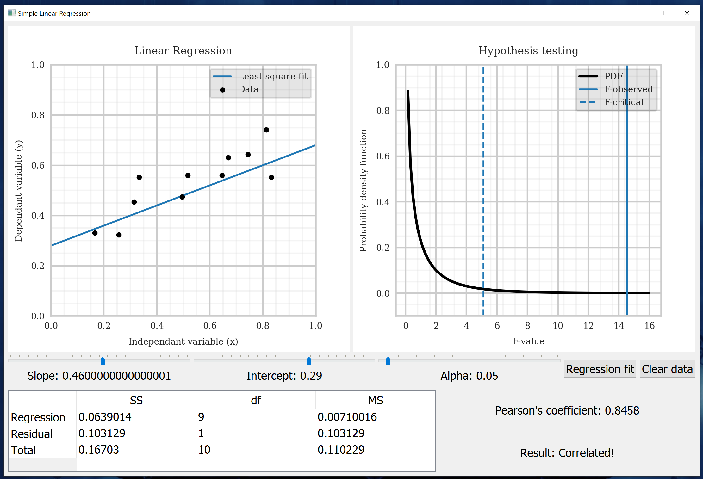

# Linear Regression GUI

This project implements a visualization of simple linear regression along with hypothesis testing to test for correlation between two variables. 

### Features
- Data points can be added interactively (with mouse clicks)!
- Compute pearson correlation and ANOVA table for hypothesis testing of simple linear regression.

### Requirements
- numpy
- scipy
- matplotlib
- PyQt5

